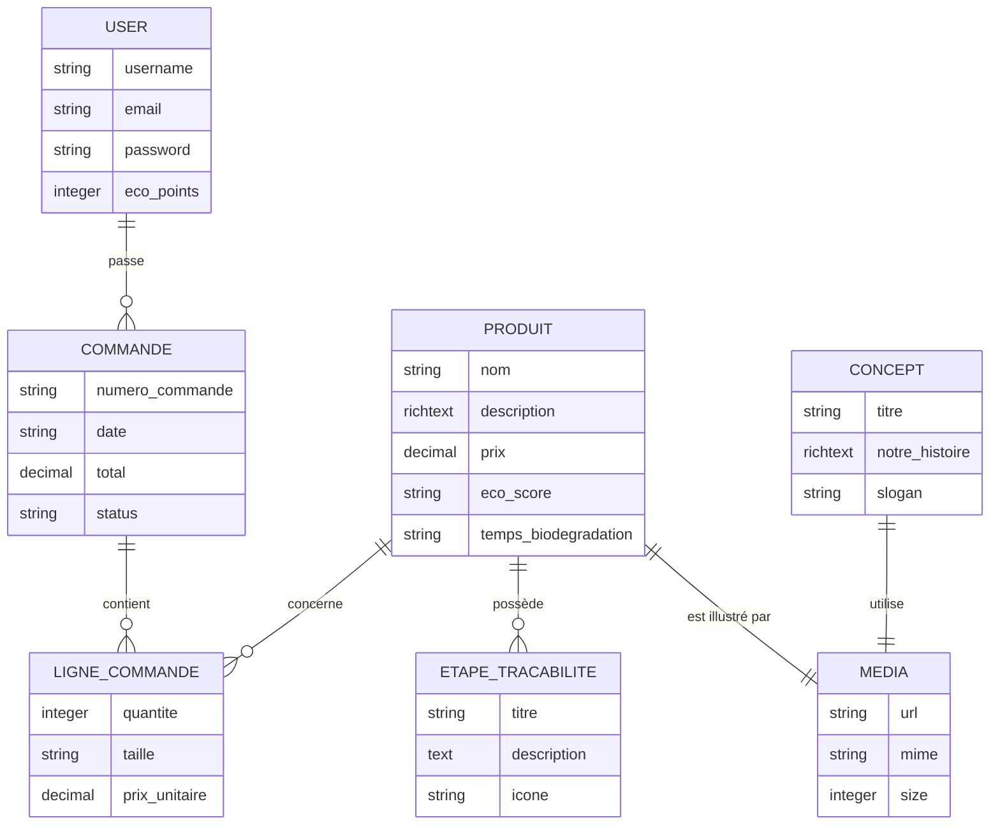

# Documents de Production : Base de Données (Projet WARA)

Ce document regroupe l'ensemble des livrables techniques concernant la conception et la structure de la base de données du projet WARA (SAE 2.02).

---

## 1. Dictionnaire de Données

Le dictionnaire de données liste l'ensemble des propriétés stockées pour chaque entité du système.

### Table : Produit (Product)
| Champ | Type | Description | Contraintes |
| :--- | :--- | :--- | :--- |
| **id** | Entier | Identifiant unique du produit | PK, Auto-incrément |
| **nom** | Chaîne | Nom commercial du vêtement (ex: "T-shirt Sargasse") | Requis, Localisé |
| **description** | Texte Riche | Description détaillée (storytelling, caractéristiques) | Localisé |
| **prix** | Décimal | Prix de vente TTC en euros | Requis |
| **image** | Média | Relation vers le fichier image (stocké via Strapi) | Requis |
| **eco_score** | Enum | Score environnemental du produit (A, B, C, D, E) | - |
| **temps_biodegradation** | Chaîne | Texte indiquant la durée de décomposition | Localisé |
| **etapes_tracabilite** | Composant | Liste ordonnée des étapes de fabrication | Répétable |

### Table : Concept (Concept Page)
| Champ | Type | Description | Contraintes |
| :--- | :--- | :--- | :--- |
| **id** | Entier | Identifiant unique de la page | PK |
| **titre** | Chaîne | Titre principal de la page Concept | Requis, Localisé |
| **notre_histoire** | Texte Riche | Texte de présentation de la marque et du projet | Localisé |
| **image_banniere** | Média | Image de couverture de la page | - |
| **slogan** | Chaîne | Slogan de la marque WARA | Localisé |

### Table : Commande (Order)
| Champ | Type | Description | Contraintes |
| :--- | :--- | :--- | :--- |
| **id** | Entier | Identifiant unique de la commande | PK, Auto-incrément |
| **numero_commande** | Chaîne | Numéro de commande unique (ex: WR-2026-9874) | Requis, Unique |
| **date** | Date / Chaîne | Date de passation de la commande | Requis |
| **total** | Décimal | Montant total TTC de la commande | Requis |
| **status** | Enum | État de la commande (En préparation, Expédié, Livré) | Requis |
| **user_id** | Entier | Identifiant de l'utilisateur ayant passé la commande | FK (Relation N:1 vers la table User) |

### Composant : Etape de Traçabilité
| Champ | Type | Description | Contraintes |
| :--- | :--- | :--- | :--- |
| **id** | Entier | Identifiant de l'instance du composant | PK |
| **titre** | Chaîne | Nom de l'étape (ex: "Collecte des Sargasses") | Requis |
| **description** | Texte | Explications sur le processus technique de l'étape | Requis |
| **icone** | Chaîne | Identifiant ou classe de l'icône à afficher | - |

---

## 2. MCD (Modèle Conceptuel de Données)

Le MCD représente les entités et leurs relations logiques.



---

## 3. MLD (Modèle Logique de Données)

Le MLD traduit les relations en structure de tables prêtes pour une base relationnelle.

- **PRODUIT** (<u>id_produit</u>, nom, description, prix, eco_score, temps_biodegradation, #id_media)
- **ETAPE_TRACABILITE** (<u>id_etape</u>, titre, description, icone, #id_produit)
- **CONCEPT** (<u>id_concept</u>, titre, notre_histoire, slogan, #id_media_banniere)
- **MEDIA** (<u>id_media</u>, url, mime, size, hash, extension)
- **USER** (<u>id_user</u>, username, email, password, eco_points)
- **COMMANDE** (<u>id_commande</u>, numero_commande, date, total, status, #id_user)
- **LIGNE_COMMANDE** (<u>id_ligne</u>, quantite, taille, prix_unitaire, #id_commande, #id_produit)

---

## 4. Schéma Physique (MPD / Script SQL)

Voici le script SQL théorique permettant de créer la structure de base de données correspondante.

```sql
-- Création de la table Media (Gestionnaire de fichiers)
CREATE TABLE media (
    id SERIAL PRIMARY KEY,
    url VARCHAR(255) NOT NULL,
    mime VARCHAR(50),
    size INTEGER,
    extension VARCHAR(10)
);

-- Création de la table Produit
CREATE TABLE product (
    id SERIAL PRIMARY KEY,
    nom VARCHAR(255) NOT NULL,
    description TEXT,
    prix DECIMAL(10, 2) NOT NULL,
    eco_score VARCHAR(1) CHECK (eco_score IN ('A', 'B', 'C', 'D', 'E')),
    temps_biodegradation VARCHAR(255),
    image_id INTEGER REFERENCES media(id) ON DELETE SET NULL
);

-- Création de la table pour les Etapes de Traçabilité (Relation 1:N avec Produit)
CREATE TABLE product_tracabilite_steps (
    id SERIAL PRIMARY KEY,
    titre VARCHAR(255) NOT NULL,
    description TEXT NOT NULL,
    icone VARCHAR(255),
    product_id INTEGER REFERENCES product(id) ON DELETE CASCADE
);

-- Création de la table pour la page Concept
CREATE TABLE concept_page (
    id SERIAL PRIMARY KEY,
    titre VARCHAR(255) NOT NULL,
    notre_histoire TEXT,
    slogan VARCHAR(255),
    image_banniere_id INTEGER REFERENCES media(id) ON DELETE SET NULL
);

-- Création de la table User (Espace client)
CREATE TABLE users (
    id SERIAL PRIMARY KEY,
    username VARCHAR(255) NOT NULL,
    email VARCHAR(255) NOT NULL UNIQUE,
    password VARCHAR(255) NOT NULL,
    eco_points INTEGER DEFAULT 0
);

-- Création de la table Commande (Order)
CREATE TABLE orders (
    id SERIAL PRIMARY KEY,
    numero_commande VARCHAR(50) NOT NULL UNIQUE,
    date VARCHAR(100) NOT NULL,
    total DECIMAL(10, 2) NOT NULL,
    status VARCHAR(50) NOT NULL,
    user_id INTEGER REFERENCES users(id) ON DELETE CASCADE
);

-- Création de la table Ligne de Commande (Items de la commande)
CREATE TABLE order_items (
    id SERIAL PRIMARY KEY,
    quantite INTEGER NOT NULL,
    taille VARCHAR(10) NOT NULL,
    prix_unitaire DECIMAL(10, 2) NOT NULL,
    order_id INTEGER REFERENCES orders(id) ON DELETE CASCADE,
    product_id INTEGER REFERENCES product(id) ON DELETE SET NULL
);
```
