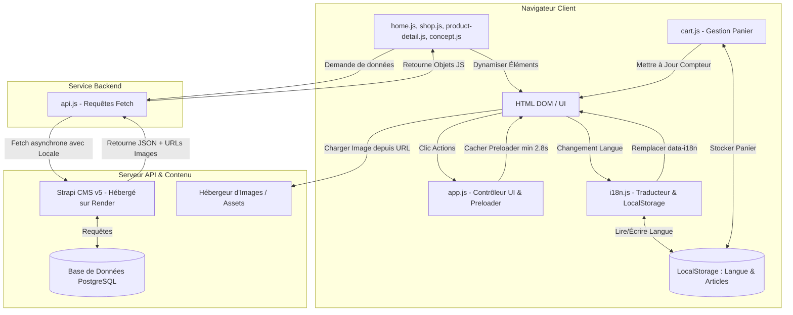

# 📜 Rapport de Conception Web — Projet WARA
## 🏷️ Agence Digitale `the4way` | BUT MMI Guadeloupe (SAÉ 2.02)
---

> [!NOTE]
> Ce rapport technique et fonctionnel est structuré aux couleurs de l'identité de notre agence **the4way** (Expertise hybride : Management, Création, Développement) et synthétise le développement du projet **WARA : De la sargasse au vêtement**.

---

## 👥 1. L'Équipe et les Rôles de l'Agence `the4way`
Notre agence regroupe les 4 expertises fondamentales du BUT MMI pour concevoir des expériences numériques durables et performantes :

*   **Clara-Marie DUPIL** : Cheffe de projet & Stratégie (Management, Planification de projet, Stratégie SEO, Cadre réglementaire et Rédaction du plan de communication).
*   **Raïssa GRADEL** : Design graphique & Direction Artistique (Identité visuelle de WARA, logotype, charte graphique, moodboard colorimétrique et UI kit).
*   **Daryl CAIRO** : Design web & Production audiovisuelle (Storyboard utilisateur, maquettage haute fidélité, réalisation des vidéos de bannière et conception de la transition animée préloader).
*   **David COLOMBO** (Développeur Principal) : Programmation & Intégration technique (Écoconception CSS, logique JavaScript asynchrone, intégration du CMS headless Strapi, implémentation multilingue i18n, gestion du panier et transitions dynamiques).

---

## 🛠️ 2. Structure et Contenu du Build (Fichiers)

Le projet est conçu comme une application web multipage (MPA) optimisée, séparant strictement la structure (HTML), le style (CSS), la logique (JS), et les données (Strapi 5).

### 📁 A. Les Fichiers HTML (Structure)

| Fichier | Rôle / Description | Éléments Clés du Build |
| :--- | :--- | :--- |
| [index.html](file:///c:/Users/david/Documents/SAE2.02/Developpement_Web/index.html) | Page d'accueil interactive. | Conteneur vidéo hero responsive, section d'engagements centrée et grille des produits vedettes. |
| [boutique.html](file:///c:/Users/david/Documents/SAE2.02/Developpement_Web/boutique.html) | Catalogue des vêtements biodégradables. | Grille de produits dynamiques alimentée par l'API, filtres de catégories interactifs. |
| [produit.html](file:///c:/Users/david/Documents/SAE2.02/Developpement_Web/produit.html) | Fiche détaillée d'un vêtement spécifique. | Sélecteur de tailles, bouton d'ajout au panier, **frise chronologique de biodégradation interactive** et carte de traçabilité "De la plage au vêtement". |
| [concept.html](file:///c:/Users/david/Documents/SAE2.02/Developpement_Web/concept.html) | Récit de la marque et processus de transformation. | Bannière dynamique et texte d'histoire chargés depuis Strapi, infographie vectorielle des étapes de transformation (Collecte -> Confection). |
| [panier.html](file:///c:/Users/david/Documents/SAE2.02/Developpement_Web/panier.html) | Tunnel d'achat simplifié. | Liste récapitulative des articles avec calcul dynamique des taxes, frais de livraison locaux et totaux. |
| [mentions-legales.html](file:///c:/Users/david/Documents/SAE2.02/Developpement_Web/mentions-legales.html) | Conformité juridique (Loi AGEC, décret 2025-957). | Mentions légales réglementant les allégations environnementales et la traçabilité. |

### 🎨 B. Les Fichiers CSS (Style et Animations)

*   [css/style.css](file:///c:/Users/david/Documents/SAE2.02/Developpement_Web/css/style.css) :
    *   **Design System** : Définition des variables racine (`--color-ocean`, `--color-sargasse`, `--color-sand`, `--color-terracotta`).
    *   **Typography** : Importation et configuration de `Cormorant Garamond` (Titres élégants) et `Outfit` (UI et corps de texte lisible).
    *   **Animation du Préchargeur (Preloader)** : Implémentation du balayage de l'eau de mer (`.sea-water-sweep` avec filtre SVG pour effet liquide) et de la chute physique de 8 branches de sargasse vectorielles (`@keyframes fall-and-land`) atterrissant sur le sable à des hauteurs décalées.
    *   **Responsive Layouts** : Flexbox et Grid CSS avec media-queries adaptées aux mobiles et ordinateurs (centrage harmonisé).

### ⚙️ C. Les Fichiers JavaScript (Logique Client)

*   [js/config.js](file:///c:/Users/david/Documents/SAE2.02/Developpement_Web/js/config.js) : Détermine automatiquement l'adresse du serveur d'API (Strapi local si l'hôte est `localhost`, sinon l'API en production hébergée sur Render : `https://sae2-02wara.onrender.com`).
*   [js/api.js](file:///c:/Users/david/Documents/SAE2.02/Developpement_Web/js/api.js) : Abstraction des requêtes HTTP asynchrones. Optimise les appels (Eco-conception) en limitant les champs récupérés via Strapi 5 (`CONFIG.GRID_FIELDS`).
*   [js/translations.js](file:///c:/Users/david/Documents/SAE2.02/Developpement_Web/js/translations.js) : Base de données locale de traduction contenant les textes français (FR) et anglais (EN).
*   [js/i18n.js](file:///c:/Users/david/Documents/SAE2.02/Developpement_Web/js/i18n.js) : Moteur d'internationalisation qui scanne le DOM à la recherche des attributs `data-i18n` et remplace les textes dynamiquement selon la langue sauvegardée dans le `localStorage`.
*   [js/app.js](file:///c:/Users/david/Documents/SAE2.02/Developpement_Web/js/app.js) : Contrôleur global. Gère le menu burger mobile, l'initialisation de la bibliothèque d'animation AOS et la **temporisation stricte de 2,8s** du préchargeur pour une transition fluide sans clignotement.
*   [js/components.js](file:///c:/Users/david/Documents/SAE2.02/Developpement_Web/js/components.js) : Charge dynamiquement le Header commun, le Footer et la structure HTML du préchargeur sur toutes les pages pour éviter la duplication de code.
*   [js/home.js](file:///c:/Users/david/Documents/SAE2.02/Developpement_Web/js/home.js) : Gère le chargement asynchrone des produits vedettes de la page d'accueil et le slider vidéo Hero.
*   [js/shop.js](file:///c:/Users/david/Documents/SAE2.02/Developpement_Web/js/shop.js) : Récupère les données depuis Strapi, crée les cartes produits et applique les filtres par catégorie.
*   [js/product-detail.js](file:///c:/Users/david/Documents/SAE2.02/Developpement_Web/js/product-detail.js) : Extrait l'ID du produit depuis l'URL, récupère les données détaillées, initialise l'interactivité de la frise chronologique de biodégradation et gère l'ajout au panier.
*   [js/concept.js](file:///c:/Users/david/Documents/SAE2.02/Developpement_Web/js/concept.js) : Dynamise la page concept en chargeant la bannière et le texte historique depuis l'API Strapi.
*   [js/quiz.js](file:///c:/Users/david/Documents/SAE2.02/Developpement_Web/js/quiz.js) : Logique de l'application interactive de style (Style Quiz) recommandant un look éco-responsable adapté.
*   [js/cart.js](file:///c:/Users/david/Documents/SAE2.02/Developpement_Web/js/cart.js) : Gère les opérations de lecture/écriture du panier d'achat stocké localement.

---

## 📊 3. Schéma de Fonctionnement Technique
Voici le diagramme illustrant les interactions asynchrones du site WARA avec le CMS headless Strapi 5 et la persistance locale :



---

## 🚶‍♂️ 4. Parcours Utilisateurs (User Journeys)

Notre stratégie de ciblage s'articule autour de nos personas clés définis par l'équipe marketing :

### 🌟 Parcours A : Alexander (Cible Internationale Eco-Luxe Premium)
*   **Objectif** : Acquérir une pièce de mode unique avec une traçabilité irréprochable et un faible impact carbone.
```
[Visite le site] 
       ↓
[Découvre l'animation de transition Toon avec les Sargasses tombant sur le sable]
       ↓
[Arrivée sur la Home : Lit le slogan "De la sargasse au vêtement" & lance la vidéo d'ambiance]
       ↓
[Bascule en anglais (EN) via le sélecteur de langue -> Traduction instantanée i18n]
       ↓
[Accède à la Boutique -> Filtre sur la catégorie "Premium"]
       ↓
[Sélectionne la Robe Femme ou le Costume Homme]
       ↓
[Consulte la Fiche Produit : Interagit avec la frise de biodégradation]
       ↓
[Consulte la carte de traçabilité "De la plage au vêtement" (plages de Guadeloupe)]
       ↓
[Choisit la taille, ajoute au panier et valide son achat en toute confiance]
```

### 🌴 Parcours B : Inès (Cible Locale Fashion-Activiste de Guadeloupe)
*   **Objectif** : Soutenir l'économie locale et trouver un style caribéen moderne adapté au climat tropical.
```
[Visite le site]
       ↓
[S'intéresse au concept de valorisation locale]
       ↓
[Lance le "Style Quiz" interactif sur la Home ou la Boutique]
       ↓
[Répond aux 5 questions rapides (Style, Couleurs préférées, Climat, etc.)]
       ↓
[L'algorithme calcule son profil et recommande une tenue assortie]
       ↓
[Clique sur le vêtement recommandé -> Fiche produit détaillée chargée depuis Strapi]
       ↓
[Ajoute l'article au panier en bénéficiant de tarifs pays locaux]
```

---

## ⚠️ 5. Problèmes Rencontrés & Résolutions Techniques

Au cours du cycle de développement, l'équipe technique a fait face à plusieurs défis majeurs résolus grâce à une étroite collaboration entre développement et design :

### 1️⃣ Clignotement du contenu temporaire sur la page d'accueil (Flickering)
*   **Problème** : Lors du chargement initial de la page d'accueil, le texte temporaire en dur ("T-shirt Test") apparaissait pendant une fraction de seconde avant que le script `home.js` ne récupère les vraies données depuis Strapi (Render) et ne mette à jour la page.
*   **Résolution** : 
    *   Mise en place d'un **Préchargeur (Preloader)** dynamique global.
    *   Utilisation d'une variable globale `window.isAsyncLoading = true` sur les pages dynamiques.
    *   Introduction d'une fonction de temporisation stricte à **2.8 secondes minimum** (`window.hidePreloader`) garantissant que la transition Toon s'affiche complètement et se retire uniquement lorsque les données de l'API sont injectées et prêtes dans le DOM.

### 2️⃣ Synchronisation de la traduction au premier chargement (i18n)
*   **Problème** : Le titre principal affichait brièvement "Né du fléau des Caraïbes" (le texte en dur dans le HTML) avant que le script d'internationalisation ne vienne injecter la traduction "De la sargasse au vêtement".
*   **Résolution** : Synchronisation complète du fallback HTML de `index.html` avec les clés de `translations.js` pour éviter tout flash visuel désagréable au chargement.

### 3️⃣ Synchronisation des IDs de vêtements avec Strapi
*   **Problème** : L'API cherchait à récupérer le vêtement avec l'identifiant statique `ID: 6` qui n'existait pas dans l'instance Strapi du client (où le costume homme avait l'ID `1` et la robe femme l'ID `3`).
*   **Résolution** : Modification de la logique de routage dans `shop.js` et `product-detail.js`. Les identifiants sont désormais extraits dynamiquement de l'API lors du clic sur une carte de produit (`produit.html?id=${product.id}`), éliminant tout hardcoding d'ID.

### 4️⃣ Intégration de la Mer et du Sable dans l'animation vectorielle
*   **Problème** : La transition initiale de page était trop abrupte. L'eau ne semblait pas "laisser" les sargasses sur le sable.
*   **Résolution** : 
    *   Création d'un bloc `.sea-water-sweep` qui glisse de haut en bas avec un effet de vagues SVG inversées via `transform: scaleY(-1)` pour une transition fluide.
    *   Animation de dépôt physique : les sargasses tombent à des vitesses différentes et s'arrêtent à des hauteurs précises pour simuler leur échouement sur le fond sableux (`Sand White`).

### 5️⃣ Problèmes de centrage sur Desktop
*   **Problème** : Les grilles d'engagement et de storytelling d'accueil étaient parfaitement adaptées au mobile mais s'alignaient maladroitement à gauche ou s'étiraient trop sur grand écran.
*   **Résolution** : Ajustement des règles CSS Flexbox et CSS Grid avec des propriétés `margin: 0 auto;` et `justify-content: center;` couplées à une largeur maximale (`max-width: 1200px`) pour garantir un centrage géométrique parfait sur tous les supports.

---

> [!TIP]
> **Prêt pour la soutenance** : Ce dossier de conception illustre comment l'agence **the4way** a su allier rigueur académique, démarche d'éco-conception logicielle (requêtes API optimisées, performances CSS pures) et storytelling immersif pour faire de **WARA** une marque remarquable.
